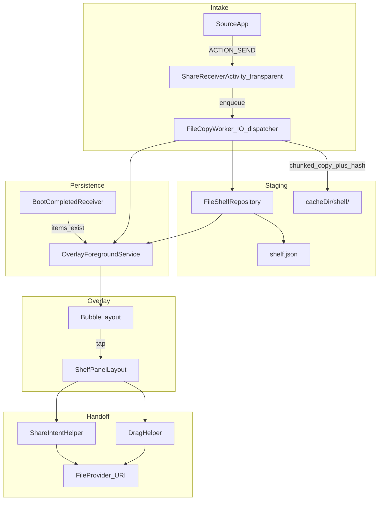

# Android Temporary File Shelf (Floating Bubble) — Detailed Implementation Plan

## What you are building

A **high-speed file routing utility** (not a file manager):

1. User shares a file from WhatsApp (or any app) → your app appears in the share / open-with list
2. File is **chunk-copied** into `cacheDir/shelf/` with SHA-256 deduplication
3. A **persistent floating bubble** shows staged file count
4. Tap bubble → **shelf panel** lists files
5. **Move files out:**
   - **Primary (reliable):** tap → Android share sheet → Gmail, Drive, WPS, etc.
   - **Secondary (split-screen only):** long-press → drag to apps that support drop

**Architectural mindset:** transient staging shelf that self-cleans — like macOS Dropover / Yoink on touch, not a floating file explorer.



---

## Honest Android limits

| Desktop expectation | Android reality | Plan mitigation |
|---|---|---|
| Drag to any app | Only in split-screen / multi-window | Share sheet as primary; drag as bonus with in-app hint |
| Bubble always visible | OS kills background services | FGS + boot receiver + restore from shelf.json |
| Unlimited staging | Cache can be cleared by OS | Treat as temp; warn user; 24h auto-expire |
| Instant share | Large files take time to copy | Progress notification during copy; transparent share activity |

---

## Lightweight stack

| Piece | Choice | Why |
|---|---|---|
| Language | Kotlin | Native overlay + FGS + intent control |
| Build | Gradle Kotlin DSL, single `:app` module | Minimal surface area |
| UI (screens) | Jetpack Compose Material 3 | One full-screen shelf + onboarding |
| UI (bubble) | Plain `View` + `WindowManager` | Compose in overlays is fragile |
| Async | Coroutines + `Dispatchers.IO` | Never block main thread |
| Copy I/O | `InputStream.read(byteArray)` loop | No `readBytes()` — prevents OOM |
| Hash | `MessageDigest.getInstance("SHA-256")` | Dedup during copy, no second pass |
| Storage | `cacheDir/shelf/` + `shelf.json` | No Room/SQLite overhead |
| DI | None | ~12–15 classes total |
| Image preview | Skip for MVP — MIME type icons only | Avoid Coil dep until v2 |

**Versions:** `minSdk 26`, `compileSdk 35`, `targetSdk 35`

---

## Complete project structure

```
app/
  src/main/
    AndroidManifest.xml
    res/
      xml/file_paths.xml                    # FileProvider paths
      values/themes.xml                     # TransparentShareTheme
      drawable/                             # bubble circle, mime icons
    java/com/yourname/fileshelf/
      ShareReceiverActivity.kt
      MainActivity.kt
      receiver/
        BootCompletedReceiver.kt
      service/
        OverlayService.kt
        FileCopyService.kt                  # optional: long copies as FGS
      overlay/
        BubbleLayout.kt
        ShelfPanelLayout.kt
        OverlayWindowManager.kt             # centralizes add/update/remove views
      data/
        StagedFile.kt
        ShelfState.kt                       # sealed: Idle / Copying / Ready / Error
        FileShelfRepository.kt
      worker/
        FileCopyWorker.kt                   # chunked copy + hash + progress
      util/
        ShareIntentHelper.kt
        DragHelper.kt
        MimeIconResolver.kt
        PermissionHelper.kt
        NotificationHelper.kt
      FileShelfApp.kt                       # Application: cleanup on cold start
```

---

## Gradle dependencies (exact)

```kotlin
// app/build.gradle.kts
android {
    namespace = "com.yourname.fileshelf"
    compileSdk = 35
    defaultConfig {
        minSdk = 26
        targetSdk = 35
        applicationId = "com.yourname.fileshelf"
    }
    buildFeatures { compose = true }
    composeOptions { kotlinCompilerExtensionVersion = "1.5.14" } // match Kotlin version
}

dependencies {
    implementation(platform("androidx.compose:compose-bom:2024.06.00"))
    implementation("androidx.compose.ui:ui")
    implementation("androidx.compose.material3:material3")
    implementation("androidx.activity:activity-compose:1.9.0")
    implementation("androidx.core:core-ktx:1.13.1")
    implementation("org.jetbrains.kotlinx:kotlinx-coroutines-android:1.8.1")
    implementation("androidx.lifecycle:lifecycle-runtime-ktx:2.8.2")
}
```

No Hilt, Room, Navigation, Coil for MVP.

---

## AndroidManifest.xml (complete spec)

```xml
<manifest xmlns:android="http://schemas.android.com/apk/res/android">

    <!-- Overlay bubble -->
    <uses-permission android:name="android.permission.SYSTEM_ALERT_WINDOW" />

    <!-- Foreground service -->
    <uses-permission android:name="android.permission.FOREGROUND_SERVICE" />
    <uses-permission android:name="android.permission.FOREGROUND_SERVICE_SPECIAL_USE" />

    <!-- FGS notification (API 33+) -->
    <uses-permission android:name="android.permission.POST_NOTIFICATIONS" />

    <!-- Restore bubble after reboot -->
    <uses-permission android:name="android.permission.RECEIVE_BOOT_COMPLETED" />

    <application
        android:name=".FileShelfApp"
        android:allowBackup="false"
        android:icon="@mipmap/ic_launcher"
        android:label="@string/app_name"
        android:theme="@style/Theme.FileShelf">

        <!-- FULL SCREEN: onboarding + shelf fallback -->
        <activity
            android:name=".MainActivity"
            android:exported="true"
            android:launchMode="singleTop"
            android:theme="@style/Theme.FileShelf">
            <intent-filter>
                <action android:name="android.intent.action.MAIN" />
                <category android:name="android.intent.category.LAUNCHER" />
            </intent-filter>
        </activity>

        <!-- TRANSPARENT: share intake — user must never see a flash -->
        <activity
            android:name=".ShareReceiverActivity"
            android:exported="true"
            android:excludeFromRecents="true"
            android:noHistory="true"
            android:taskAffinity=""
            android:theme="@style/Theme.FileShelf.Transparent"
            android:launchMode="singleTask">
            <!-- Single file -->
            <intent-filter>
                <action android:name="android.intent.action.SEND" />
                <category android:name="android.intent.category.DEFAULT" />
                <data android:mimeType="*/*" />
            </intent-filter>
            <intent-filter>
                <action android:name="android.intent.action.SEND" />
                <category android:name="android.intent.category.DEFAULT" />
                <data android:mimeType="image/*" />
            </intent-filter>
            <intent-filter>
                <action android:name="android.intent.action.SEND" />
                <category android:name="android.intent.category.DEFAULT" />
                <data android:mimeType="video/*" />
            </intent-filter>
            <intent-filter>
                <action android:name="android.intent.action.SEND" />
                <category android:name="android.intent.category.DEFAULT" />
                <data android:mimeType="audio/*" />
            </intent-filter>
            <intent-filter>
                <action android:name="android.intent.action.SEND" />
                <category android:name="android.intent.category.DEFAULT" />
                <data android:mimeType="application/*" />
            </intent-filter>
            <intent-filter>
                <action android:name="android.intent.action.SEND" />
                <category android:name="android.intent.category.DEFAULT" />
                <data android:mimeType="text/*" />
            </intent-filter>
            <!-- Multiple files -->
            <intent-filter>
                <action android:name="android.intent.action.SEND_MULTIPLE" />
                <category android:name="android.intent.category.DEFAULT" />
                <data android:mimeType="*/*" />
            </intent-filter>
        </activity>

        <!-- OVERLAY + BUBBLE -->
        <service
            android:name=".service.OverlayService"
            android:exported="false"
            android:foregroundServiceType="specialUse">
            <property
                android:name="android.app.PROPERTY_SPECIAL_USE_FGS_SUBTYPE"
                android:value="Persistent floating file shelf bubble for cross-app file staging" />
        </service>

        <!-- BOOT: restore bubble if shelf non-empty -->
        <receiver
            android:name=".receiver.BootCompletedReceiver"
            android:exported="true"
            android:enabled="true">
            <intent-filter>
                <action android:name="android.intent.action.BOOT_COMPLETED" />
            </intent-filter>
        </receiver>

        <!-- FILE SHARING -->
        <provider
            android:name="androidx.core.content.FileProvider"
            android:authorities="${applicationId}.fileprovider"
            android:exported="false"
            android:grantUriPermissions="true">
            <meta-data
                android:name="android.support.FILE_PROVIDER_PATHS"
                android:resource="@xml/file_paths" />
        </provider>
    </application>
</manifest>
```

### Transparent theme (fixes "ghost" share flash)

`res/values/themes.xml`:

```xml
<style name="Theme.FileShelf.Transparent" parent="android:Theme.Translucent.NoTitleBar">
    <item name="android:windowIsTranslucent">true</item>
    <item name="android:windowBackground">@android:color/transparent</item>
    <item name="android:windowNoTitle">true</item>
    <item name="android:windowAnimationStyle">@null</item>
    <item name="android:backgroundDimEnabled">false</item>
</style>
```

In `ShareReceiverActivity.onCreate()` also call:

```kotlin
overridePendingTransition(0, 0)
// in onPause/onDestroy as well:
overridePendingTransition(0, 0)
```

---

## Component 1: ShareReceiverActivity (detailed)

### URI extraction (handle ALL senders)

WhatsApp, Telegram, Gmail, Gallery each pack URIs differently. Always collect from **both** sources:

```kotlin
fun extractShareUris(intent: Intent): List<Pair<Uri, String?>> {
    val results = mutableListOf<Pair<Uri, String?>>()
    val mime = intent.type

    // 1. clipData (most reliable for WhatsApp)
    intent.clipData?.let { clip ->
        for (i in 0 until clip.itemCount) {
            clip.getItemAt(i).uri?.let { uri ->
                results.add(uri to (clip.getItemAt(i).uri?.let { mime }))
            }
        }
    }

    // 2. EXTRA_STREAM (single)
    if (Build.VERSION.SDK_INT >= Build.VERSION_CODES.TIRAMISU) {
        intent.getParcelableExtra(Intent.EXTRA_STREAM, Uri::class.java)
    } else {
        @Suppress("DEPRECATION")
        intent.getParcelableExtra(Intent.EXTRA_STREAM)
    }?.let { uri ->
        if (results.none { it.first == uri }) results.add(uri to mime)
    }

    // 3. EXTRA_STREAM (multiple — some use ArrayList)
    intent.getParcelableArrayListExtra<Uri>(Intent.EXTRA_STREAM)?.forEach { uri ->
        if (results.none { it.first == uri }) results.add(uri to mime)
    }

    return results
}
```

### Activity lifecycle (no visible transition)

```
onCreate:
  1. setContentView is NOT needed (no layout) OR empty FrameLayout
  2. Parse intent; if empty → finish() immediately
  3. For each URI → FileCopyWorker.enqueue(context, uri, mime)
  4. OverlayService.startIfNeeded(context)   // does NOT wait for copy to finish
  5. finish()
  6. overridePendingTransition(0, 0)

onNewIntent (singleTask):
  Same as steps 3–6 for additional shares while activity alive
```

**Critical:** Do NOT call `startForegroundService` synchronously with heavy work on main thread. Enqueue copy → return immediately.

### Text-only shares (edge case)

If `intent.type` starts with `text/` and no URI (shared link/text), either:
- Ignore silently and finish(), OR
- Save as `{uuid}.txt` in shelf

MVP: ignore text-only; only stage files with URIs.

---

## Component 2: FileCopyWorker (OOM-safe chunked copy)

### Why this exists

- `inputStream.readBytes()` loads entire file into RAM → **OOM on 500MB+ videos**
- Must copy on `Dispatchers.IO`, never Main
- Hash during copy (single pass, no re-read)

### Algorithm

```kotlin
object FileCopyWorker {
    private const val BUFFER_SIZE = 8192           // 8 KB — safe on all devices
    private const val MAX_FILE_BYTES = 500L * 1024 * 1024  // 500 MB cap (configurable)

    suspend fun copyToShelf(
        context: Context,
        sourceUri: Uri,
        mimeType: String?,
        onProgress: (bytesCopied: Long, total: Long?) -> Unit
    ): Result<StagedFile> = withContext(Dispatchers.IO) {
        val resolver = context.contentResolver

        // 1. Resolve display name
        val displayName = resolver.queryDisplayName(sourceUri)
            ?: "file_${System.currentTimeMillis()}"

        // 2. Open stream with permission already granted by share intent
        val input = resolver.openInputStream(sourceUri)
            ?: return@withContext Result.failure(Exception("Cannot open URI"))

        // 3. Optional: get size for progress (may be -1 for some providers)
        val totalSize = resolver.openFileDescriptor(sourceUri, "r")?.use {
            it.statSize.takeIf { s -> s > 0 }
        }

        if (totalSize != null && totalSize > MAX_FILE_BYTES) {
            return@withContext Result.failure(Exception("File exceeds 500 MB limit"))
        }

        // 4. Dedup fast-path: if same name+size already in shelf, skip
        val existing = FileShelfRepository.findByNameAndSize(context, displayName, totalSize)
        if (existing != null) return@withContext Result.success(existing)

        // 5. Chunked copy + SHA-256
        val destFile = FileShelfRepository.createDestFile(context, displayName)
        val digest = MessageDigest.getInstance("SHA-256")
        var bytesCopied = 0L
        val buffer = ByteArray(BUFFER_SIZE)

        input.use { ins ->
            destFile.outputStream().use { out ->
                while (true) {
                    val read = ins.read(buffer)
                    if (read == -1) break
                    out.write(buffer, 0, read)
                    digest.update(buffer, 0, read)
                    bytesCopied += read
                    if (bytesCopied > MAX_FILE_BYTES) {
                        destFile.delete()
                        return@withContext Result.failure(Exception("File exceeds limit during copy"))
                    }
                    onProgress(bytesCopied, totalSize)
                }
            }
        }

        val hash = digest.digest().joinToString("") { "%02x".format(it) }

        // 6. Dedup by hash — delete duplicate file if hash exists
        val hashDupe = FileShelfRepository.findByHash(context, hash)
        if (hashDupe != null) {
            destFile.delete()
            return@withContext Result.success(hashDupe)
        }

        // 7. Persist metadata atomically
        val staged = StagedFile(
            id = UUID.randomUUID().toString(),
            displayName = displayName,
            mimeType = mimeType ?: resolver.getType(sourceUri) ?: "application/octet-stream",
            localPath = destFile.absolutePath,
            sizeBytes = bytesCopied,
            sha256 = hash,
            addedAt = System.currentTimeMillis()
        )
        FileShelfRepository.add(context, staged)
        Result.success(staged)
    }
}
```

### Progress notification during copy

For files > 5 MB, show a **separate short-lived notification** ("Copying video.mp4… 42%") via `NotificationHelper`. Dismiss on complete/fail.

If copy takes > 30 seconds, consider promoting to a lightweight `FileCopyService` FGS — optional for MVP; notification is sufficient.

### Coroutine scope ownership

Use `applicationScope` in `FileShelfApp`:

```kotlin
class FileShelfApp : Application() {
    val appScope = CoroutineScope(SupervisorJob() + Dispatchers.Default)

    override fun onCreate() {
        super.onCreate()
        appScope.launch { FileShelfRepository.cleanupExpired(this@FileShelfApp) }
    }
}
```

Never use unstructured `GlobalScope`.

---

## Component 3: FileShelfRepository (detailed)

### StagedFile model

```kotlin
@Serializable
data class StagedFile(
    val id: String,
    val displayName: String,
    val mimeType: String,
    val localPath: String,
    val sizeBytes: Long,
    val sha256: String,
    val addedAt: Long
)
```

Use `kotlinx.serialization.json` (add plugin) OR manual org.json — for minimal deps, manual JSON with `org.json.JSONObject` is fine.

### shelf.json format

```json
{
  "version": 1,
  "items": [
    {
      "id": "uuid",
      "displayName": "document.pdf",
      "mimeType": "application/pdf",
      "localPath": "/data/user/0/.../cache/shelf/uuid_document.pdf",
      "sizeBytes": 1048576,
      "sha256": "abc123...",
      "addedAt": 1718450000000
    }
  ]
}
```

### Concurrency safety

Multiple shares can arrive quickly. Use **`Mutex`** (kotlinx.coroutines.sync.Mutex) around all read-modify-write:

```kotlin
private val writeMutex = Mutex()

suspend fun add(context: Context, file: StagedFile) = writeMutex.withLock {
    val list = loadInternal(context).toMutableList()
    if (list.size >= MAX_ITEMS) removeOldest(list)  // or reject with error
    list.add(file)
    saveAtomic(context, list)
}
```

### Atomic write (prevent corrupt shelf.json)

```kotlin
private fun saveAtomic(context: Context, items: List<StagedFile>) {
    val file = shelfJsonFile(context)
    val tmp = File(file.parent, "${file.name}.tmp")
    tmp.writeText(serialize(items))
    if (!tmp.renameTo(file)) {
        file.writeText(tmp.readText())
        tmp.delete()
    }
}
```

### Orphan cleanup

On every load, remove entries whose `localPath` file no longer exists (OS may have cleared cache).

### Limits

| Rule | Value |
|---|---|
| Max items | 20 (remove oldest on overflow) |
| Max file size | 500 MB |
| TTL | 24 hours from `addedAt` |
| Dedup | SHA-256 primary; name+size fast-path before copy |

---

## Component 4: FileProvider + URI permissions (CRITICAL)

### file_paths.xml

```xml
<?xml version="1.0" encoding="utf-8"?>
<paths>
    <cache-path name="shelf" path="shelf/" />
</paths>
```

Authority: `"${applicationId}.fileprovider"` — must match manifest.

### ShareIntentHelper (exact flags — missing = SecurityException in target app)

```kotlin
object ShareIntentHelper {
    fun buildShareIntent(context: Context, file: StagedFile): Intent {
        val localFile = File(file.localPath)
        require(localFile.exists()) { "Staged file missing: ${file.localPath}" }

        val uri = FileProvider.getUriForFile(
            context,
            "${context.packageName}.fileprovider",
            localFile
        )

        return Intent(Intent.ACTION_SEND).apply {
            type = file.mimeType
            putExtra(Intent.EXTRA_STREAM, uri)
            putExtra(Intent.EXTRA_SUBJECT, file.displayName)
            addFlags(Intent.FLAG_GRANT_READ_URI_PERMISSION)  // REQUIRED
            clipData = ClipData.newUri(context.contentResolver, file.displayName, uri)
            addFlags(Intent.FLAG_GRANT_READ_URI_PERMISSION)  // also on clipData path
        }
    }

    fun launchChooser(context: Context, file: StagedFile) {
        val intent = buildShareIntent(context, file)
        context.startActivity(
            Intent.createChooser(intent, "Send ${file.displayName}").apply {
                addFlags(Intent.FLAG_ACTIVITY_NEW_TASK)
            }
        )
    }
}
```

**Why both `putExtra` and `clipData`:** Some target apps (Samsung, WPS) read one or the other.

**For chooser:** `FLAG_GRANT_READ_URI_PERMISSION` on the send intent is sufficient; chooser forwards grant to selected app.

### DragHelper (exact flags)

```kotlin
object DragHelper {
    fun startDrag(view: View, context: Context, file: StagedFile): Boolean {
        val localFile = File(file.localPath)
        if (!localFile.exists()) return false

        val uri = FileProvider.getUriForFile(
            context,
            "${context.packageName}.fileprovider",
            localFile
        )

        val clip = ClipData.newUri(
            context.contentResolver,
            file.displayName,
            uri
        )

        return view.startDragAndDrop(
            clip,
            View.DragShadowBuilder(view),
            file,  // localState — non-null marks cross-view drag
            View.DRAG_FLAG_GLOBAL or View.DRAG_FLAG_GLOBAL_URI_READ
        )
    }
}
```

Target app must call `Activity.requestDragAndDropPermissions(event)` — not your problem, but document in hint.

### Verification checklist (run during dev)

- Share PDF to Gmail → attachment opens without crash
- Share image to WhatsApp → sends successfully
- Drag in split-screen to Files app → file appears
- If SecurityException in logcat → missing `FLAG_GRANT_READ_URI_PERMISSION` or FileProvider path mismatch

---

## Component 5: OverlayService (detailed)

### Start sequence (Android 15 compliance)

Order matters on API 35 when starting from background:

```
1. Check Settings.canDrawOverlays() — if false, skip bubble; notify MainActivity only
2. Add bubble view to WindowManager FIRST (visible overlay)
3. THEN call startForeground(NOTIFICATION_ID, notification)
4. Load shelf count from repository; update badge
```

Reverse order → crash or FGS start rejection on Android 15.

### WindowManager params (bubble)

```kotlin
val params = WindowManager.LayoutParams(
    bubbleSizePx,
    bubbleSizePx,
    WindowManager.LayoutParams.TYPE_APPLICATION_OVERLAY,
    WindowManager.LayoutParams.FLAG_NOT_FOCUSABLE or
        WindowManager.LayoutParams.FLAG_LAYOUT_NO_LIMITS,
    PixelFormat.TRANSLUCENT
).apply {
    gravity = Gravity.TOP or Gravity.START
    x = savedX ?: defaultX
    y = savedY ?: defaultY
}
```

Persist bubble X/Y in `SharedPreferences` so position survives service restart.

### Touch handling (drag bubble)

```kotlin
// On ACTION_DOWN: record offsetX, offsetY
// On ACTION_MOVE: params.x = rawX - offsetX; params.y = rawY - offsetY; wm.updateViewLayout()
// On ACTION_UP: snapToNearestEdge(); save prefs
```

Use `VelocityTracker` optional for fling-to-edge.

### Shelf panel overlay

Second `WindowManager` view — larger, `FLAG_NOT_FOCUSABLE` still, but add close button.

- Anchor panel near bubble; flip to opposite side if off-screen
- Max height ~40% screen; scroll if > 5 items
- Dismiss on tap outside (optional `FLAG_WATCH_OUTSIDE_TOUCH`)

### Service lifecycle states

```kotlin
enum class OverlayState { Starting, Running, Stopping }

// onDestroy:
//   remove bubble view
//   remove shelf panel view
//   stopForeground(STOP_FOREGROUND_REMOVE)
```

### Battery kill recovery

If OEM kills service:
- Files remain in cache + shelf.json
- Next share OR boot receiver OR user opens app → restarts service
- Do NOT assume service is always alive

### Notification (FGS — required)

Channel: `"file_shelf_overlay"` — importance LOW (non-intrusive)

Content:
- Title: "File shelf active"
- Text: "3 files staged"
- Actions: `Open shelf` | `Dismiss all`

Tap notification → expand shelf panel or MainActivity.

---

## Component 6: BootCompletedReceiver

### Purpose

After reboot, `cacheDir/shelf/` and `shelf.json` may still exist but `OverlayService` is dead → user loses bubble.

### Logic

```kotlin
class BootCompletedReceiver : BroadcastReceiver() {
    override fun onReceive(context: Context, intent: Intent) {
        if (intent.action != Intent.ACTION_BOOT_COMPLETED) return

        val items = FileShelfRepository.loadSync(context)
        if (items.isEmpty()) return

        if (!Settings.canDrawOverlays(context)) return  // cannot show bubble

        if (!PermissionHelper.hasNotificationPermission(context)) return  // FGS needs notif on API 33+

        OverlayService.start(context)
    }
}
```

**Do NOT** start overlay on boot if shelf empty — Play reviewers flag unnecessary FGS starts.

Register only `BOOT_COMPLETED` — no `QUICKBOOT` unless testing on Xiaomi (optional OEM filter later).

---

## Component 7: MainActivity + onboarding

### Screens (Compose)

1. **Welcome** — explain staging shelf concept (not file manager)
2. **Overlay permission** — why needed + button → `Settings.ACTION_MANAGE_OVERLAY_PERMISSION`
3. **Notification permission** (API 33+) — required for persistent bubble
4. **FGS disclosure** (Play requirement) — explicit text:

   > "File Shelf runs a small foreground service to keep the floating bubble visible while you move files between apps. No data leaves your device."

5. **Shelf list** — same as overlay panel but full screen

### Fallback mode (overlay denied)

- Share intake still works
- Copy still works
- User opens app manually to see shelf and share out
- Show persistent banner: "Enable overlay for floating bubble"

### State observation

Use `Flow` from repository or poll on `ON_RESUME` to refresh list when copies complete in background.

Show **copy-in-progress** rows with spinner for pending URIs (optional pending queue in repository).

---

## Component 8: Drag-and-drop UX

### In-app hint (show once)

Store `SharedPreferences["hint_drag_seen"]`:

> "Drag-and-drop works in split-screen: open the target app first, enter split-screen, then long-press a file and drag."

### Long-press threshold

Use `ViewConfiguration.getLongPressTimeout()` — do not hardcode.

### Haptic feedback

`view.performHapticFeedback(HapticFeedbackConstants.LONG_PRESS)` on drag start.

---

## Google Play specialUse FGS — rejection-proof submission

Google **aggressively rejects** vague `specialUse` justifications. Prepare for **first rejection + appeal**.

### In-app requirements (before enabling bubble)

- Dedicated screen explaining FGS purpose (see onboarding step 4)
- User must tap **"Enable floating shelf"** — explicit opt-in
- No bubble/FGS until opt-in + permissions granted

### Play Console declaration

**Foreground service type:** `specialUse`

**Declaration text (copy-paste base):**

> File Shelf provides a persistent floating bubble overlay (similar to picture-in-picture) that lets users temporarily stage files received from other apps (e.g. WhatsApp) and share them to a destination app without switching context. The foreground service is required to keep this user-initiated overlay visible while the user multitasks. The service stops when the user dismisses the shelf or clears all files. No location, microphone, or background data collection occurs.

### Screen recording script (30–60 seconds) — attach to appeal

1. Open WhatsApp → share a PDF
2. Select File Shelf from share sheet
3. Show **no visible app transition** (transparent activity)
4. Show bubble appearing over WhatsApp
5. Tap bubble → shelf opens
6. Tap share → send to Gmail
7. Show notification: "File shelf active"
8. Dismiss all → bubble disappears → show service stopped

### If rejected

Appeal with:
- Video above
- Statement: FGS stops when shelf empty (implement `stopSelf()` when last file removed)
- No tracking, no ads in overlay
- Link to in-app disclosure screen timestamp in video

### Alternative if repeated rejection (plan B — document now, implement only if needed)

Remove persistent FGS; use **short-lived overlay** that dies after 5 min inactivity without FGS. UX worse but policy-safe. **Do not implement unless rejected twice.**

---

## Error catalog (prevent during coding)

| Error | Cause | Fix in plan |
|---|---|---|
| `SecurityException` reading URI in Gmail | Missing grant flag | ShareIntentHelper flags above |
| Black flash on share | Opaque activity theme | Transparent theme + no animation |
| OOM on large video | `readBytes()` | 8 KB chunked copy |
| Duplicate 50 MB file | No dedup | SHA-256 during copy |
| Corrupt shelf.json | Crash mid-write | Atomic tmp + rename |
| Bubble not after reboot | No boot receiver | BootCompletedReceiver |
| FGS crash API 35 | FGS before overlay visible | Overlay first, then startForeground |
| `IllegalArgumentException` FileProvider | Wrong path | `cache-path shelf/` matches `cacheDir/shelf/` |
| Empty share from WhatsApp | Only checked EXTRA_STREAM | Also read clipData |
| Service leak | Views not removed | Remove all views in onDestroy |
| ANR on share | Copy on main thread | Dispatchers.IO only |
| Target app can't open file | Wrong MIME | Use resolver.getType + fallback octet-stream |
| Filename collision | Same name different content | Prefix dest with UUID: `{uuid}_{name}` |
| shelf.json race | Concurrent shares | Mutex on all writes |
| Notification not shown API 33 | No POST_NOTIFICATIONS | Request in onboarding |
| Bubble off-screen | No bounds check | Clamp x/y on drag end |
| Cache cleared by OS | Stale shelf.json entries | Orphan cleanup on load |

---

## Testing matrix (complete before Play upload)

### Share intake
- [ ] WhatsApp image (single)
- [ ] WhatsApp PDF document
- [ ] WhatsApp video > 50 MB (progress notification)
- [ ] Gallery multi-select via SEND_MULTIPLE
- [ ] Duplicate share same file (dedup — only 1 entry)
- [ ] File > 500 MB (rejected with toast)
- [ ] Share while bubble already visible (appends count)

### Share out
- [ ] Share to Gmail (attachment readable)
- [ ] Share to WhatsApp
- [ ] Share to Drive
- [ ] Share to WPS Office
- [ ] Share after app process killed (FileProvider still works)

### Overlay
- [ ] Bubble drag + edge snap
- [ ] Bubble survives home button
- [ ] Service killed → next share restores bubble
- [ ] Reboot with staged files → bubble returns (boot receiver)
- [ ] Overlay permission denied → full-screen fallback works
- [ ] Clear all → service stops, notification gone

### Drag (split-screen)
- [ ] Split-screen with Files app → drag PDF → drop works
- [ ] Full-screen single app → drag attempted → show hint (may fail — expected)

### Edge
- [ ] Low storage device → copy fails gracefully
- [ ] Airplane mode (should still work — local only)
- [ ] Dark/light mode shelf readable
- [ ] Rotation with overlay (re-layout or lock orientation to portrait for MVP)

**MVP orientation recommendation:** Lock `ShareReceiverActivity` and overlay to portrait OR handle `onConfigurationChanged` in service — pick one during scaffold to avoid half-implemented rotation bugs.

---

## Implementation order (strict — do not skip)

1. **Scaffold** — project, manifest, themes, FileProvider, empty classes
2. **FileShelfRepository** — JSON CRUD, mutex, atomic write, cleanup
3. **FileCopyWorker** — chunked copy + hash + unit test with 10 MB fake stream
4. **ShareReceiverActivity** — transparent, URI extract, enqueue copy
5. **MainActivity shelf** — list, share, remove (proves end-to-end without overlay)
6. **ShareIntentHelper** — verify Gmail/WPS manually
7. **OverlayService** — bubble only, then FGS notification
8. **ShelfPanelLayout** — tap bubble expands
9. **BootCompletedReceiver**
10. **DragHelper** + hint
11. **Onboarding + FGS disclosure**
12. **Full testing matrix**
13. **Play Store assets**

---

## Privacy + Data Safety (Play Console)

- **Data collected:** None
- **Data shared:** None
- **Files:** Processed locally in app cache only; deleted after 24h or user clear
- **Privacy policy:** Required URL — host simple static page (GitHub Pages free)

Sample privacy policy bullets:
- Files received via share intent are copied to app cache
- Files are never uploaded to any server
- Cache auto-expires after 24 hours
- User can clear all at any time

---

## What "lightweight" means

- ~15 Kotlin files, zero database, zero backend
- Cache-only, JSON metadata, 8 KB stream buffers
- Single module, no DI framework
- Estimated APK: **under 5 MB**

---

## Market positioning (context)

Most "floating file manager" apps are bloated explorers in a window — wrong UX for quick routing. This app wins by being a **transient clipboard for files** with self-cleaning cache. Keep scope frozen for v1; no browse-Filesystem, no cloud sync, no accounts.
